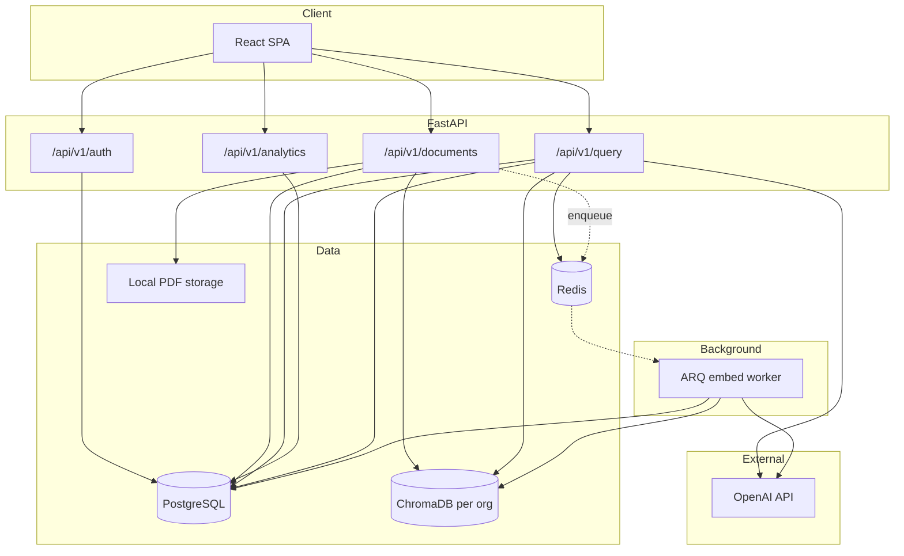
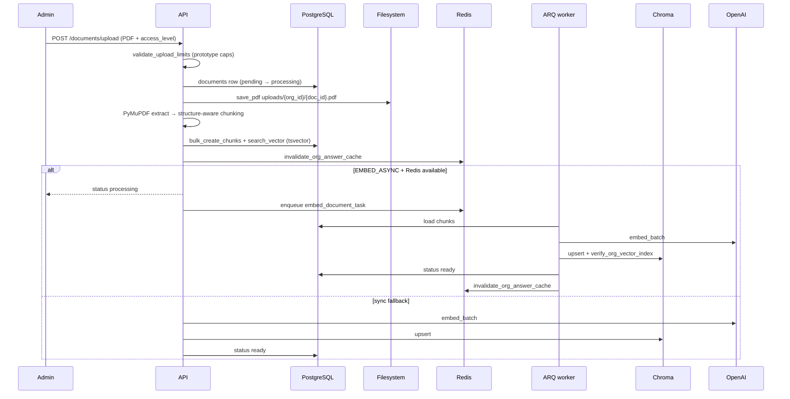
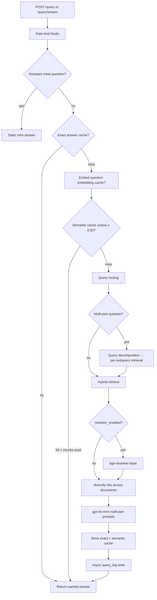
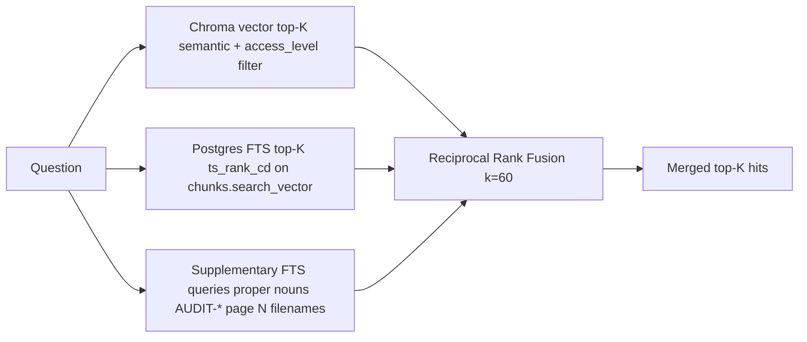

# Enterprise Knowledge Assistant

Multi-tenant enterprise knowledge assistant: upload PDF policies and handbooks, ask natural-language questions, get **citation-backed answers** scoped by organization and role. Not a RAG demo backend — a full product with auth, invites, document lifecycle, streaming chat, analytics, hybrid retrieval, Redis caching, async ingestion, and automated regression.

**Stack:** FastAPI · PostgreSQL · ChromaDB · Redis · ARQ worker · OpenAI (`text-embedding-3-small` + `gpt-4o-mini`) · React (Vite) SPA.

**What makes it complete:** JWT + rotating refresh tokens · RBAC + invites · admin upload / replace / delete · role-filtered Library · SSE streaming chat with inline PDF citations · query analytics.

---

## Quick start

### Prerequisites

Docker Desktop (or Docker Engine + Compose v2) and an OpenAI API key.

### Run with Docker (recommended)

Starts PostgreSQL, Redis, API, ARQ worker, and the web UI (nginx serves the SPA and proxies `/api/`).

```powershell
cd docker
copy .env.example .env
# Edit .env: POSTGRES_PASSWORD, JWT_SECRET, OPENAI_API_KEY
# Optional: DEMO_ADMIN_EMAIL / DEMO_ADMIN_PASSWORD for one-click demo sign-in
docker compose up --build -d
```

Open **http://localhost** — sign in with the **Demo** button (when demo credentials are set in `.env`), upload a PDF as admin, then ask a question.

| Service | URL |
|---------|-----|
| UI | http://localhost |
| API docs | http://localhost/docs |
| Health | http://localhost/health |

Env reference: [`docker/.env.example`](docker/.env.example). Post-deploy smoke: `python backend/scripts/deploy_smoke.py --api <url> --origin <ui-url>`.

<details>
<summary>Local development without Docker</summary>

Requires Python 3.11+, PostgreSQL, Node.js 18+, and Redis.

**Backend**

```powershell
cd backend
python -m venv .venv
copy .env.example .env
# Edit .env: DATABASE_URL, OPENAI_API_KEY, JWT_SECRET
.\.venv\Scripts\pip install -r requirements.txt
.\.venv\Scripts\alembic upgrade head
.\.venv\Scripts\uvicorn app.main:app --reload
```

**ARQ worker** (when `EMBED_ASYNC=true`):

```powershell
cd backend
.\.venv\Scripts\arq app.worker.settings.WorkerSettings
```

**Frontend**

```powershell
cd frontend
npm install
copy .env.example .env
npm run dev
```

Open http://localhost:5173. Env reference: [`backend/.env.example`](backend/.env.example).

</details>

### Continuous deployment (GitHub Actions)

Pushes to `main` trigger [`.github/workflows/deploy.yml`](.github/workflows/deploy.yml) **only when files under `backend/`, `frontend/`, `docker/`, `scripts/deploy-ec2.sh`, or the workflow itself change**. README, `.gitignore`, and other docs-only commits do **not** run deploy (by design). Use **Actions → Deploy to EC2 → Run workflow** to deploy manually anytime.

The workflow SSHs into EC2 and runs [`scripts/deploy-ec2.sh`](scripts/deploy-ec2.sh): `git fetch` + reset to `origin/main`, then `docker compose up --build -d`, then waits for `GET /health`.

**One-time EC2 setup:** clone the repo, create `docker/.env` from `.env.example`, run `docker compose up --build -d` once manually. Ensure the security group allows SSH from GitHub Actions runners (not only your home IP).

**Repository secrets** (Settings → Secrets and variables → Actions):

| Secret | Value |
|--------|--------|
| `EC2_HOST` | Public hostname or IP (e.g. `ec2-….compute.amazonaws.com`) |
| `EC2_USER` | SSH user (e.g. `ubuntu`) |
| `EC2_SSH_KEY` | Full contents of the `.pem` key file |
| `EC2_DEPLOY_PATH` | *(optional)* Absolute path to the repo on the server; defaults to `~/Multi-Tenant-Enterprise-Knowledge-Platform-RAG-` |

**Not automated:** first-time server provisioning, new `.env` variables, or GitHub secret changes — update those on EC2 or in repo settings, then push code or re-run the workflow.

---

## 1. System architecture

### 1.1 High-level diagram



### 1.2 Multi-tenancy

| Concern | Implementation |
|---------|----------------|
| Relational data | Shared PostgreSQL; every tenant row scoped by `organization_id` |
| JWT claims | `sub` (user_id), `organization_id`, `role` |
| Vectors | One Chroma collection per org: `org_{organization_id}` |
| Source of truth | **PostgreSQL** — Chroma is a derived embedding index |
| Isolation | Verified in multi-org regression — **0 cross-org answer leaks** in latest 100-Q benchmark |

### 1.3 Document ingest pipeline



**Document lifecycle**

| Action | Behavior |
|--------|----------|
| **Replace** (same filename) | Re-ingest same `document_id`; PG chunks replaced; Chroma re-embedded; cache invalidated |
| **Delete** | Remove PG row, Chroma vectors, filesystem PDF; cache invalidated |
| **PATCH access_level** | Update PG + Chroma metadata filter; cache invalidated |
| **Status machine** | `pending` → `processing` → `ready` \| `failed` — admin can delete/replace stuck docs |

### 1.4 Query / RAG pipeline



**Routing inputs:** filename → `document_id` filter · `page N` → page filter · `AUDIT-*` token → content filter + FTS boost · topic keywords → topic document scoping · multi-part → decomposition + RRF merge.

---

## 2. Component deep-dive

For each subsystem: **what it does** · **why we chose it** · **tradeoffs** · **if unavailable**.

### 2.1 PostgreSQL

| Table | Purpose |
|-------|---------|
| `organizations` | Tenant root |
| `users` | Auth + role enum (`admin` / `manager` / `employee`) |
| `invites` | Join-existing-org tokens |
| `documents` | Metadata, `status`, `access_level` |
| `chunks` | Text + `search_vector` (`TSVECTOR`, GIN index) |
| `query_logs` | `question`, `answer`, `latency_ms`, `retrieved_chunk_ids` (JSONB), `token_usage` (JSONB) |
| `refresh_tokens` | Rotating refresh token hashes |

**Why:** Authoritative metadata, FTS for exact tokens, audit trail.  
**Tradeoff:** PG FTS excels at `AUDIT-*`, policy IDs, filenames — not a standalone semantic search replacement.  
**If down:** Application cannot start.

### 2.2 ChromaDB

- **Collection:** `org_{uuid}` per organization.
- **Chunk metadata:** `organization_id`, `document_id`, `chunk_id`, `access_level`, `filename`, `page_number`, `section_name`.
- **Filters:** `access_level` (RBAC) + optional `document_id`, `page_number`.

**Why:** Simple local persistent vectors; per-org hard boundary.  
**Tradeoff:** Derived index can drift — `rebuild_org_vector_index` on `VectorIndexCorruptedError` (self-healing from Postgres). Not horizontally scalable without migration to managed vector DB.  
**If down/unreachable:** Queries return no retrieval hits.

### 2.3 Hybrid search



| Path | Wins when |
|------|-----------|
| **Vector** | Paraphrases — "paid time off" ↔ "PTO policy" |
| **FTS** | Exact tokens, audit IDs, filenames, page references |
| **RRF** | No score normalization; robust merge of ranked lists |

Config: `HYBRID_SEARCH_ENABLED=true`, `HYBRID_RRF_K=60`.

### 2.4 Redis — key schema

| Key pattern | Type | Purpose | TTL |
|-------------|------|---------|-----|
| `cache:org_version:{org_id}` | string (int) | Org-wide cache generation; `INCR` on upload/delete/replace | none |
| `cache:answer:{org_id}:{role}:v{version}:{sha256(normalized_q)}` | string (JSON) | Exact answer cache | `CACHE_TTL_SECONDS` (3600) |
| `cache:semantic:{org_id}:{role}:v{version}:index` | list (JSON entries) | Semantic cache — question, embedding, response, chunk_ids | list TTL |
| `cache:embed:{sha256(normalized_q)}` | string (JSON float[]) | Query embedding cache | `CACHE_TTL_SECONDS` |
| `rl:{org_id}:{user_id}` | counter | Rate limit per user per org | 3600s window |

**Invalidation flow:**

```text
upload / delete / replace / access_level change / embed complete
  → purge_org_query_cache
    → DELETE cache:answer:{org_id}:*
    → DELETE cache:semantic:{org_id}:*
    → INCR cache:org_version:{org_id}
```

**Semantic cache safety:** On hit, verify `retrieved_chunk_ids` still exist in Postgres. Skip semantic cache for page/token/filename-scoped questions (`_is_scope_sensitive_question`).

**Why:** Sub-50 ms repeat/paraphrase answers; org-wide instant invalidation via version bump.  
**Tradeoff:** Redis optional — app degrades gracefully: no cache, no rate limit, sync embed only.  
**If down:** Full RAG every query; uploads embed synchronously in API request.

### 2.5 OpenAI

| Use | Model |
|-----|-------|
| Embeddings | `text-embedding-3-small` (1536-dim) |
| Answers | `gpt-4o-mini` |

**Why:** Strong multilingual quality on demo PDFs; provider abstraction in `app/core/ai/` for future swap.  
**Tradeoff:** Cost + latency vs local models (local embeddings deferred).  
**If down:** Embedding/query endpoints fail.

### 2.6 ARQ async embedding

`EMBED_ASYNC=true` + Redis → upload returns `processing`; worker runs `embed_document_task`. Falls back to sync embed if Redis unavailable or enqueue fails.

**Why:** Fast upload API response; heavy embed work off the request thread.  
**Tradeoff:** Requires worker process in production.  
**If worker stopped:** Documents stay `processing` until worker runs or admin re-uploads.

### 2.7 RBAC & document access

| Role | Upload | Analytics | Library | Access levels |
|------|--------|-----------|---------|---------------|
| **Admin** | yes | yes | full CRUD | all |
| **Manager** | no | yes | read-only | `public`, `hr`, `engineering`, `finance` |
| **Employee** | no | no | read-only | `public` only |

Enforced at: API routes · Chroma metadata filter · `GET /documents/{id}/file` download.

### 2.8 Chunking

Structure-aware: `KEY_FACT` lines isolated, headings, bullet groups.

```env
INGEST_CHUNK_MAX_CHARS=1000
INGEST_CHUNK_OVERLAP_CHARS=100
RAG_LLM_CONTEXT_CHUNKS=20
```

**Why:** Smaller chunks → better retrieval precision for policy facts.  
**Tradeoff:** More chunks → higher embed cost. Re-upload PDFs after changing ingest settings.

### 2.9 Tier 1 retrieval

- **`topic_routing.py`:** keyword → topic slug → `{org}_{topic}.pdf` scoping.
- **`query_decomposition.py`:** multi-topic questions → scoped sub-queries → RRF merge.

**Why:** Natural employee questions ("PTO + laptop policy") need routing, not bigger `top-K` alone.  
**Tradeoff:** Keyword routing is brittle for novel phrasing; tuned for policy-demo corpora.

### 2.10 Frontend

React + Vite SPA — **Assistant** (SSE chat), **Library** (role-filtered read-only docs), **Team** (invites), **Analytics** (query logs).

- Citations stream first, then answer tokens.
- Inline citation buttons open PDF via blob URL.
- JWT refresh: short access token + rotating refresh in DB; proactive refresh in UI.

**Playwright E2E:** 24/24 passed (18 regression + 6 gap coverage) — see [`frontend/e2e/FRONTEND_E2E_REPORT.md`](frontend/e2e/FRONTEND_E2E_REPORT.md).

---

## 3. Accuracy & regression journey

Ground-truth validation: each question must produce an answer containing expected terms from a specific source PDF. We ran this across three isolated organizations (15 topic documents per org, 10–15 pages each) with 100 grounded questions.

### From 85/100 to 95/100 — filename mapping

The first pass scored **85/100**. The fifteen failures shared one pattern: the question named a specific policy file (e.g. `acme_hr_vacation.pdf`), but retrieval still searched the **entire org corpus**. With dozens of similarly structured PDFs, embedding search often returned the right *topic* from the *wrong file* — and the LLM could not recover from bad context.

The fix was **filename → document mapping** in `query_routing.py`:

1. **Detect** PDF filenames mentioned in the question (`extract_pdf_filenames`).
2. **Resolve** each name to a `document_id` for that organization (`resolve_document_filter_ids`).
3. **Scope** Chroma and hybrid FTS to only those documents before ranking chunks.

That closed most of the gap. The remaining misses were fixed with **page-number filters**, **`AUDIT-*` token routing**, **semantic-cache skips** for scope-sensitive questions, and validator tuning — reaching **95/100** with **zero cross-org leaks**.

### What we learned

1. **Accuracy is mostly retrieval**, not LLM context size — hybrid FTS + routing beat bigger prompts.
2. **Document diversification** hurt single-doc and page-1 fact retrieval — skipped when the query is scoped to a filename or page.
3. **Semantic cache** caused cross-question contamination on page-scoped queries — fixed with scope-sensitive skip + chunk validation.
4. **Natural multi-doc employee questions** need topic routing + decomposition, not `top-K` alone.
5. **Prototype limits** (15 pages, 15 docs/org) keep retrieval in a workable range for demo scale.

---

## 4. Configuration reference

Grouped from [`backend/.env.example`](backend/.env.example).

### Database & storage

| Variable | Default | Notes |
|----------|---------|-------|
| `DATABASE_URL` | — | **Required** — PostgreSQL connection |
| `UPLOAD_DIR` | `data/uploads` | PDF filesystem path |
| `CHROMA_PERSIST_DIR` | `data/chroma` | Chroma persist directory |

### Auth

| Variable | Default | Notes |
|----------|---------|-------|
| `JWT_SECRET` | — | **Required** — long random string |
| `JWT_EXPIRE_MINUTES` | `10` | Short-lived access token |
| `REFRESH_TOKEN_EXPIRE_DAYS` | `14` | Rotating refresh tokens in DB |
| `ALLOW_PUBLIC_REGISTRATION` | `true` | Set **`false` in production** |
| `INVITE_EXPIRE_DAYS` | `7` | Invite token TTL |

### AI

| Variable | Default | Notes |
|----------|---------|-------|
| `OPENAI_API_KEY` | — | **Required** |
| `EMBEDDING_MODEL` | `text-embedding-3-small` | 1536-dim |
| `LLM_MODEL` | `gpt-4o-mini` | Answer generation |

### RAG / retrieval

| Variable | Default | Notes |
|----------|---------|-------|
| `RAG_SEARCH_TOP_K` | `30` | Chroma + FTS candidates |
| `RAG_RERANK_TOP_N` | `20` | After rerank / diversify |
| `RAG_LLM_CONTEXT_CHUNKS` | `20` | Whole chunks sent to LLM |
| `RAG_CHUNK_MAX_CHARS` | `1000` | Safety cap (= ingest size) |
| `RERANKER_ENABLED` | `false` | **`false` in dev** — BGE is CPU-heavy |
| `RERANKER_MODEL` | `BAAI/bge-reranker-base` | ~400MB on first use |
| `HYBRID_SEARCH_ENABLED` | `true` | Postgres FTS + Chroma RRF |
| `HYBRID_RRF_K` | `60` | RRF constant |
| `TOPIC_ROUTING_ENABLED` | `true` | Keyword topic scoping |
| `QUERY_DECOMPOSITION_ENABLED` | `true` | Multi-part sub-queries |
| `RAG_SUBQUERY_TOP_K` | `12` | Per sub-query retrieval |
| `INGEST_CHUNK_MAX_CHARS` | `1000` | Re-upload after change |
| `INGEST_CHUNK_OVERLAP_CHARS` | `100` | Chunk overlap |

### Redis / cache

| Variable | Default | Notes |
|----------|---------|-------|
| `REDIS_URL` | `redis://127.0.0.1:6379/0` | Use `127.0.0.1` on Windows for ARQ |
| `CACHE_TTL_SECONDS` | `3600` | Answer + embedding cache TTL |
| `RATE_LIMIT_PER_HOUR` | `100` | Per user per org |
| `EMBED_ASYNC` | `true` | **`true` + worker in production** |
| `SEMANTIC_CACHE_ENABLED` | `true` | Paraphrase cache |
| `SEMANTIC_CACHE_SIMILARITY_THRESHOLD` | `0.92` | Cosine threshold |
| `SEMANTIC_CACHE_MAX_ENTRIES` | `200` | Per org/role/version list cap |

### Prototype limits

| Variable | Default | Notes |
|----------|---------|-------|
| `PROTOTYPE_MAX_PDF_PAGES` | `15` | `0` = unlimited |
| `PROTOTYPE_MAX_DOCUMENTS_PER_ORG` | `15` | `0` = unlimited; replace same filename exempt |

---

## 5. API reference

| Method | Path | Auth | Description |
|--------|------|------|-------------|
| GET | `/health` | — | Liveness |
| POST | `/api/v1/auth/register` | — | New org + admin, or join via `invite_token` |
| POST | `/api/v1/auth/login` | — | Access + refresh tokens |
| POST | `/api/v1/auth/refresh` | — | Rotate refresh token → new access token |
| POST | `/api/v1/auth/logout` | — | Revoke refresh token |
| POST | `/api/v1/auth/invite` | Bearer (admin) | Create invite for email + role |
| GET | `/api/v1/documents` | Bearer | List documents (role-filtered for non-admin) |
| POST | `/api/v1/documents/upload` | Bearer (admin) | Upload PDF + `access_level` |
| GET | `/api/v1/documents/{id}` | Bearer | Document metadata |
| GET | `/api/v1/documents/{id}/file` | Bearer | Download PDF (RBAC) |
| PATCH | `/api/v1/documents/{id}` | Bearer (admin) | Update `access_level` |
| DELETE | `/api/v1/documents/{id}` | Bearer (admin) | Delete document |
| POST | `/api/v1/query` | Bearer | RAG — blocking JSON response |
| POST | `/api/v1/query/stream` | Bearer | RAG — SSE: `citations` → `token`* → `done` |
| GET | `/api/v1/analytics/queries` | Bearer (admin/manager) | Recent query logs |

**Query logging:** `_schedule_query_log` writes asynchronously — does not block the HTTP response. Stage timings in `query_logs.token_usage.stage_timings_ms` (`embed_ms`, `chroma_ms`, `rerank_ms`, `llm_ttft_ms`, `llm_total_ms`, `total_ms`). Cache hits logged as `token_usage.cache_hit`: `"exact"` \| `"semantic"`.

---

## 6. Latency & comparison to enterprise search

Uncached queries typically **8–12 seconds** (embed + hybrid retrieval + LLM). Cached exact/semantic hits: **~50 ms**.

| Stage | Typical cost |
|-------|--------------|
| Redis exact cache | ~0 ms |
| OpenAI embedding | 300–1500 ms |
| Chroma + FTS hybrid | 50–500 ms |
| bge-reranker (if enabled) | 5–10 s CPU |
| gpt-4o-mini | 2–6 s |

| | Glean-scale | This product |
|--|-------------|--------------|
| **UX model** | Instant indexed search; AI summary optional | Chat-first full RAG |
| **Indexing** | Pre-built HNSW + BM25 hybrid | Chroma + PG FTS at query time |
| **Perceived speed** | ms retrieval, streaming, aggressive cache | SSE sources-first + Redis cache |
| **MVP choice** | Requires large infra | End-to-end RAG with citations in 7-day scope |

---

## 7. Known limitations

| Limitation | Detail |
|------------|--------|
| Prototype caps | 15 PDF pages, 15 docs/org (configurable; `0` = unlimited) |
| Storage | Local Chroma + filesystem — not S3/multi-node |
| Topic routing | Keyword-based, not ML classifier |
| Large docs | 250-page stress test: **3/100** — caps exist by design |
| Reranker | Off by default; ~400MB model download when enabled |
| Production deploy | GitHub Actions CD to EC2 (see Quick start); HTTPS needs an owned domain |

---

## 8. Additional implementation notes

- **JWT refresh rotation** — short access token (`JWT_EXPIRE_MINUTES=10`); refresh tokens stored hashed in `refresh_tokens`; reuse detection on rotation.
- **Async query logging** — response returns before `query_logs` insert completes.
- **Vector index self-healing** — `VectorIndexCorruptedError` triggers `rebuild_org_vector_index` from Postgres, then retries search.
- **Org isolation** — multi-org benchmark: each org's answers contain only that org's ground-truth tokens.
- **Security** — bcrypt passwords; JWT on all protected routes; download RBAC tested per role.
